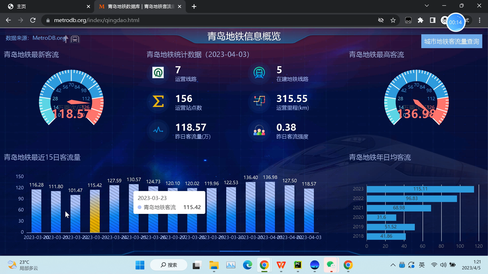
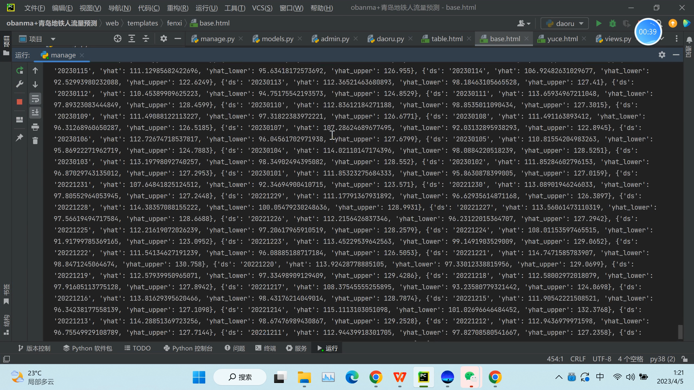
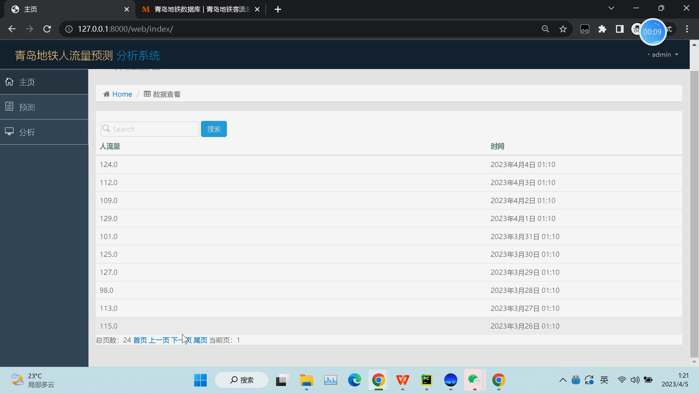
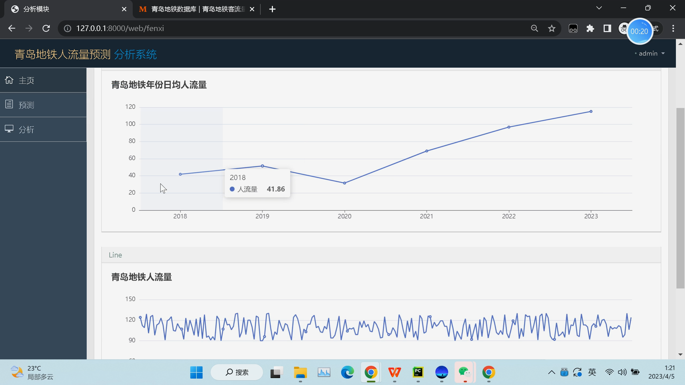
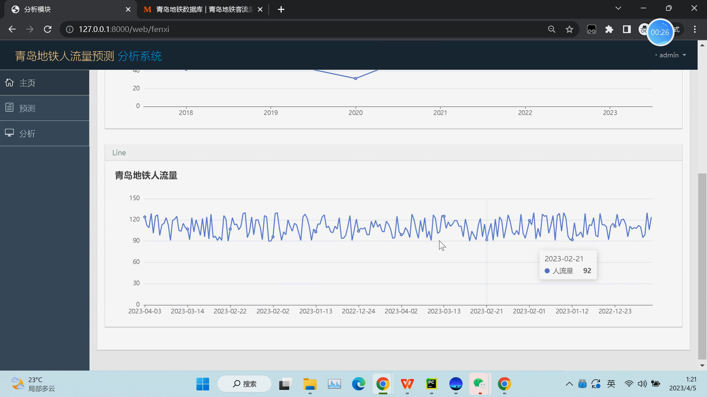
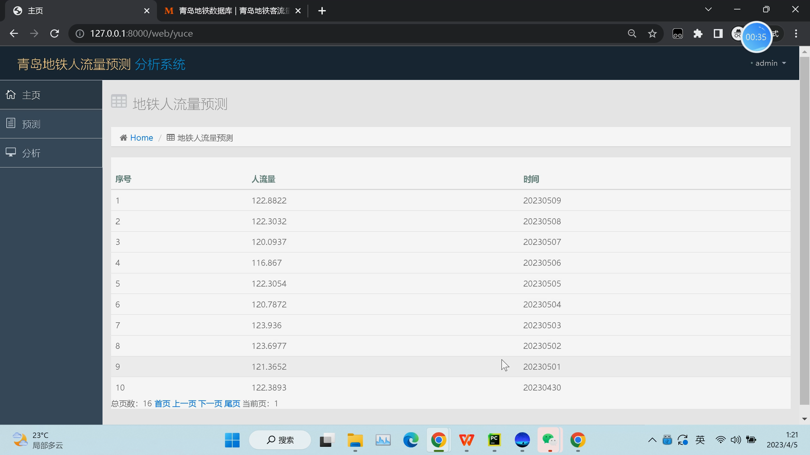
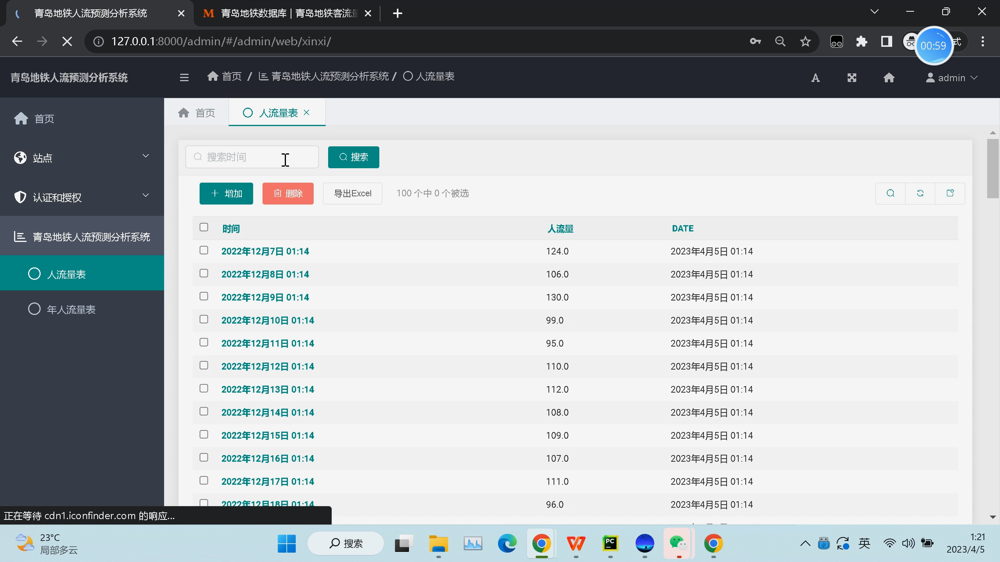
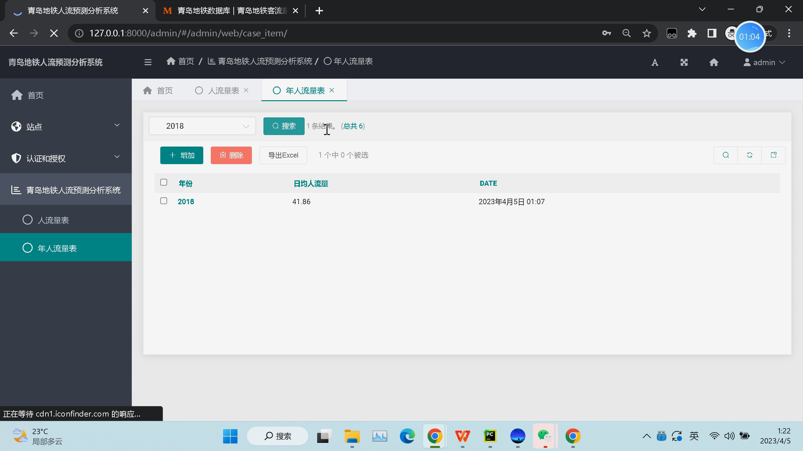

## 计算机毕业设计Django+Vue.js地铁客流量预测 时间序列预测 机器学习 预测算法 深度学习 人工智能 知识图谱 大数据毕业设计

## 要求
### 源码有偿！一套(论文 PPT 源码+sql脚本+教程)

### 
### 加好友前帮忙start一下，并备注github有偿python地铁分析预测25
### 我的QQ号是2827724252或者798059319或者 1679232425或者微信:bysj2023nb 或bysj1688

# 

### 加qq好友说明（被部分 网友整得心力交瘁）：
    1.加好友务必按照格式备注
    2.避免浪费各自的时间！
    3.当“客服”不容易，repo 主是体面人，不爆粗，性格好，文明人。

## 时间序列预测 机器学习 预测算法

### 演示视频

https://www.bilibili.com/video/BV1gZ421j7Bj

https://www.bilibili.com/video/BV14x22YvEBv/

### 演示截图

